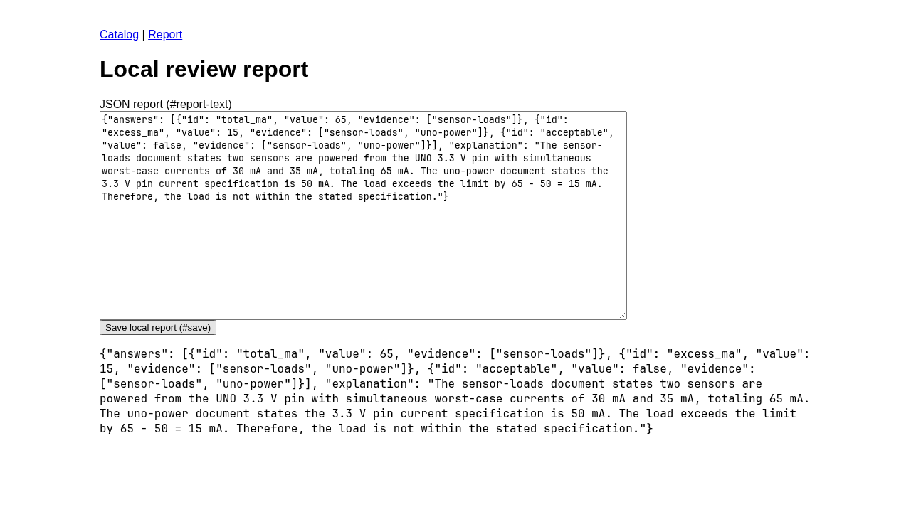

# PR 714 local evaluation — preliminary results

Measured 2026-09-25 on one RTX 4090 (24 GiB), Ryzen 7 5800X, 125 GiB RAM.
Both models used Hugging Face Unsloth UD-Q4_K_M weights and Unsloth-native
llama.cpp build 10798, commit d6b1d279f. One slot, full GPU weight offload, f16 KV,
512/128 batches, eight CPU threads, temperature zero, seeds 0/1/2, reasoning off,
no draft model/projector, no automatic fit and no context shifting. No Ollama
inference was used. The two quantized artifacts have different architectures and
mixed-precision recipes; these measurements do not isolate architecture alone.

## Original short tasks at 4K allocation

All 18 cases completed three trials on each model; all **108 result rows** have
verified local/server token accounting. The three greedy repetitions generally
repeat the same outcome and are not independent statistical samples.

| Measure | Qwen3.6-35B-A3B | Qwen3.8-27B |
|---|---:|---:|
| Full passes | 36 / 54 | 36 / 54 |
| Mean case fact accuracy | 98.15% | 94.44% |
| Mean exact evidence-set accuracy | 87.50% | 87.96% |
| Median of per-case mean task latency | 2.50 s | 7.78 s |
| Model load time | 5.02 s | 3.28 s |
| Sampled peak total GPU memory | 22,483 MiB | 16,985 MiB |

Memory includes the desktop and is sampled once per second; it is not an exact
model-only peak. Task latency includes tokenization/setup and model output of varying length;
it is not TTFT or a fixed-token decode-speed comparison. Both models were tested on the same
host serially, Qwen3.8 first, without flushing the OS page cache.

Qwen3.8's fact-score delta was -3.70 percentage points, case-cluster bootstrap
95% interval [-9.26, 0.00]. Neither model demonstrates a large general quality
improvement on this short set. Qwen3.6 was faster on every short task. Incorrect
numeric answer fields remain failures even when the later explanation corrects
them; this happened in the LED calculation. Several otherwise correct answers
failed the strict exact evidence-set rubric. Do not interpret that as a factual
engineering error. Per-case values and uncertainty are in
[short-4k-summary.json](short-4k-summary.json).

## Initial context exploration: 4K, 8K and 16K

Three original cases × four evidence positions × one trial, on each model, at each allocation. The 4K and 8K results were identical:

| Measure | Qwen3.6-35B-A3B | Qwen3.8-27B |
|---|---:|---:|
| Full passes | 2 / 12 | 8 / 12 |
| Mean fact accuracy | 100% | 100% |
| Mean exact evidence-set accuracy | 22.92% | 83.33% |

All 72 rows across the three allocations completed with verified token counts. At 16K, fact accuracy remained 100% on both models. Qwen3.6 citation accuracy fell to 8.33% (1/12 full passes); Qwen3.8 remained at 83.33% (8/12). The difference is **exact citation-identifier and evidence-set compliance**,
not factual-answer accuracy. The citation delta
is +60.42 points, with a [31.25, 75.00] case-cluster bootstrap interval, but there
are only **three independent task clusters**. This exploratory result is narrow;
it does not establish general model superiority or full-profile eligibility.
Details: [4K](context-4k-summary.json), [8K](context-8k-summary.json), and [16K](context-16k-summary.json).

Context figures are total allocations with output/wrapper reserve. The initial
4K, 8K and 16K runs used respectively 1708–1763, 5792–5847 and 14018–14070
actual input tokens on both tokenizers. They are not full-length input figures.
Larger contexts and follow-up product/browser experiments are still being
evaluated. No 1M inference claim is made in this checkpoint.

## 32K and 64K exploration

Three original cases, spread evidence, one trial per model and allocation, full
GPU weights and f16 KV. All 12 rows completed with verified tokens; both models
retained 100% fact accuracy at both levels. Full passes were 0/3 for Qwen3.6 and
2/3 for Qwen3.8 at each level. Exact-citation accuracy was 0% versus 83.33%.
[32K details](context-32k-summary.json), [64K details](context-64k-summary.json).
The exact-citation distinction persists, but identifier formatting explains much
of it; three cases do not establish general model superiority. The separate 16K bridge also completed.

## What the citation gap actually measures

Inspecting the responses exposed an important limitation: Qwen3.6 often cites
`DOCUMENT fire-pinmux` rather than the required ID `fire-pinmux`. The strict
rubric rejects that prefix even when the model names the correct document.
A **post-hoc diagnostic**, stripping that one prefix only when it reveals a known
document ID, changes Qwen3.6's mean citation score on the three-case bridge from
0% to 100% at 16K, 88.89% at 32K, and 77.78% at 64K. Qwen3.8 stays at 83.33%.
[Diagnostic details](citation-prefix-diagnostic.json).

Those are not replacement gate scores: no official row or rubric was rewritten.
They show that the large raw citation gap mainly measures identifier serialization
and exact evidence-set compliance, rather than a large difference in finding
engineering evidence. Do not present that gap as a general reasoning improvement.
Context tests remain useful for verified capacity even when both models answer
the engineering questions correctly.

## Complete original required profile

The independent profile is now complete: **102 token-verified rows per model**
(54 short, 12 browser, 36 repeated 16K context). Qwen3.6 passed 39/102 rows;
Qwen3.8 passed 63/102. The paired gate is nevertheless **blocked**: the candidate
has remaining question regressions and critical/schema failures. Aggregate pass
counts do not establish replacement eligibility. [Full gate result](full-profile-gate.json).

The repeated context arm used 4096 output tokens: both models retained 100% fact
accuracy, while mean exact-citation accuracy was 14.58% for Qwen3.6 and 83.33% for
Qwen3.8. Full passes were 3/36 versus 24/36. The citation delta's case-cluster
interval is [31.25, 100.00] percentage points across only three task clusters.
[Repeated-context details](context-16k-three-trial-summary.json). This remains a
narrow citation-format/evidence-set finding. Each paired coordinate has matching settings;
short and browser/context suites use their separately reported output budgets.

## Model-driven browser tasks at 16K allocation

All four tasks ran three trials per model with a 4096-token output budget. All
24 rows completed with verified token accounting. Qwen3.8 passed 3/12 trials
(the supply-budget task); Qwen3.6 passed 0/12. Qwen3.6 invented non-allowlisted
document selectors in three tasks and returned an answer before completing the
saved-state workflow in the fourth. Qwen3.8's failed tasks ended with malformed
action JSON. No external upload or host write occurred.

The paired pass-rate delta is +25 percentage points, with a case-cluster bootstrap
interval of [0, 75] points over only four task clusters. This does **not** establish
a statistically reliable general improvement. [Per-case results](browser-16k-summary.json).

The successful Qwen3.8 trace includes actual document reads, typing into the
report editor, saving, and verification of the saved state:

## Product pilot at 16K allocation

The fresh pilot reserved 4096 output tokens and ran all four product cases three
times per model. Qwen3.8 produced 12/12 token-verified rows and 3/12 strict passes.
Qwen3.6 produced 6/12 token-verified rows and 0/12 strict passes: battery and
telemetry responses reached the output limit. The paired gate correctly returns
**incomplete**, so these counts are not an eligible model comparison or a
superiority claim. [Per-case status](product-16k-output4k-status.json).

Qwen3.8's other nine failures contain prose outside the requested JSON. Native
`json_object` mode was requested but did not enforce object-only output in this
installed Qwen template path. A separate explicit native-grammar experiment is
planned. The original responses and strict failures remain preserved; extracting
a fenced JSON block after seeing a failure is diagnostic only, never gate evidence.

The numeric and exact-citation rubric also has limits: for example, the battery
runtime tolerance is 0.000001 hours, so a rounded 46.2857-hour answer misses the
rubric despite being practically equivalent. Such failures should not be described
as wrong release decisions. These public tasks need independently reviewed
precision and evidence-equivalence rules before broad engineering-quality claims.

## Test value and follow-up

The original short PWM and board-identity lookups were full passes for both
models in all three trials and add little discrimination here. They are marked
`skip:low-value`; original results and historical gate coverage are preserved.
Safety, abstention, negative and injection controls remain active. Four new
product tasks combine revision handling, numerical budgets, timing losses and
qualification constraints. Their answers were computed independently before
live runs; all successes and failures will be reported.

## Pinned weights and evidence

- Qwen3.6 repository: `unsloth/Qwen3.6-35B-A3B-GGUF`, revision
  `a483e9e6cbd595906af30beda3187c2663a1118c`, UD-Q4_K_M SHA256
  `ac0e2c1189e055faa36eff361580e79c5bd6f8e76bffb4ce547f167d53e31a61`.
- Qwen3.8 repository: `unsloth/Qwen3.8-27B-GGUF`, revision
  `4ca720788d1e01f1bff70c033e0d0028fd02e502`, UD-Q4_K_M SHA256
  `322e194ff79741c7baa497c240f677f54b201b0efab44ca8e50f122b39123482`.
- Shared reference tokenizer: Unsloth Qwen3.8-27B revision
  `3ea932cee0a432ae86e9c7826cbe8aef52323a28`. Each model also uses its own pinned
  tokenizer for input verification; their SHA256 values are in each row.
- Raw local evidence, relative to the evaluation worktree:
  `results/pr714/short-4k-native/` and `results/pr714/context-initial/`.
  Each contains prompts, responses, Robot reports, exact launch/served-context
  manifests, server logs and telemetry. These large local artifacts are not
  committed; the linked JSON reports are compact published summaries.

Reproduce with [the local runner guide](../../hardware-local-eval.md). The
short-run evaluation modules were unchanged across arms (the fixes in 1ed694f).
